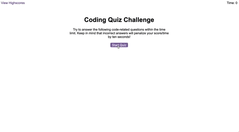

# Web APIs: Code Quiz

## A quiz about Javascript built with Javascript

### This is a timed quiz with multiple-choice questions that is built with vanilla Javascript. 

This app runs in the browser and features dynamically generated HTML elements that are powered by vanilla JavaScript. The code is also responsive, adapting to multiple screen sizes.

When the quiz is started, a timer will start. As you select your answer for each question, the next question will be presented. If a question is answered incorrectly, time is subtracted from the clock and points are subtracted from your score. 

Each question and set of answer choices are generated dynamically using native Javascript methods such as `createElement`. And when the game is over, the player's score is saved in local storage and displayed on a High Scores leaderboard along with the other high scores stored in local storage.

The live page can be viewed here: https://connietran-dev.github.io/coding-quiz/

The following animation demonstrates the application functionality. These comps were followed in large degree as an exercise in following client requests and ensuring the requested functionality could be developed successfully.

---

## Future Enhancements

If time permits, there are some future enhancements, minor tweaks, and improvements I'd like to make:

* Make `<header>` fluid so View Highscores and Timer are at edge of viewport.
* Limit input entry of initials so it meets certain requirements (e.g., not blank, three letters so it is video game style).
* Limit saving of score to a certain minimum score.
* Get the light purple hover and styling working for the `<li>`'s on the High Scores leaderboard.
* Special styling for the default quiz instructions that display when the page first loads.
* Explore a refactor of how quizQuestion and quizChoices are dynamically generated when an answer choice is selected (e.g., explore `for` loop and storing questions as objects).